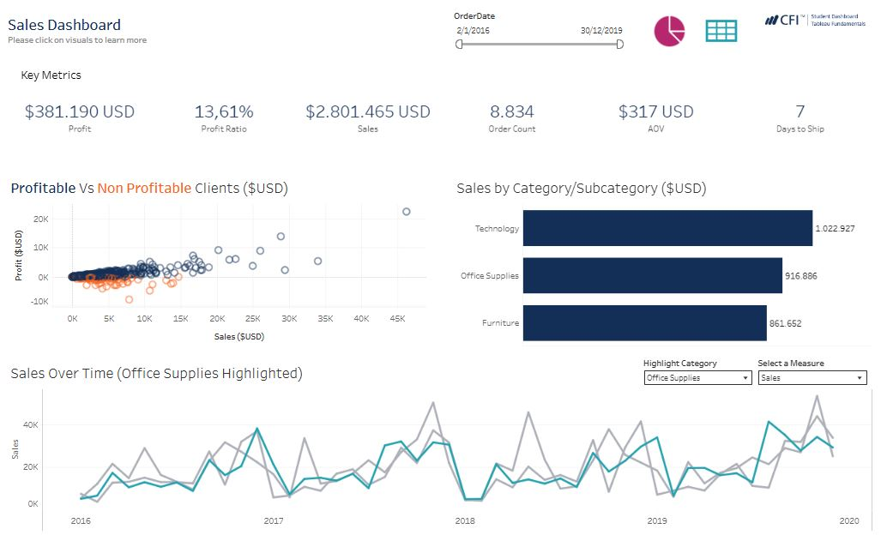
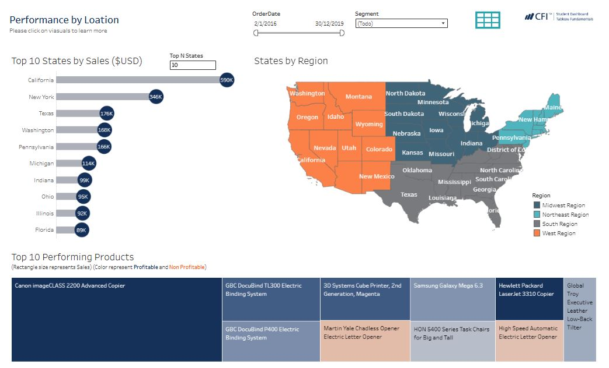

**Project Description:**  
The Office Store is a fictional e-commerce company specializing in office-related products, including Office Supplies, Furniture, and Technology. It operates exclusively online, serving General Consumers, Corporate Offices, and Home Offices across the United States, with products manufactured in the US and Canada. This project was developed during the **CFI Business Intelligence & Data Analysis (BIDA) Tableau course**.

---

## Sales Dashboard

**Key Insights:**  
- Topline summary showing high-level numbers  
- Sales by Product Category and SubCategory  
- Performance Over Time by Category  
- Most and least profitable accounts  
- % of total orders produced in Canada vs US  
- Shipping preferences by SubCategory  

**Dashboard Screenshot:**  

  

---

## Performance by Location Dashboard (5-year period)

**Key Insights:**  
- Map showing performance by region  
- Top 10 states by sales  
- Top 10 selling products  
- Table showing performance by state  

**Dashboard Screenshot:**  

  

---

## User Interaction Features
- Date-range selector  
- Segment slicer  
- Toggle buttons to show/hide charts  

---

## View Dashboards
You can explore the interactive dashboards on **Tableau Public**:  
[Open in Tableau Public](https://public.tableau.com/views/TableauFundamentals_17467114466740/SalesDashboard?:language=es-ES&publish=yes&:sid=&:redirect=auth&:display_count=n&:origin=viz_share_link)

